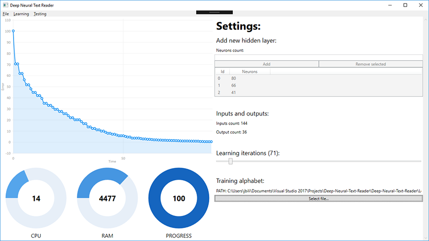

Deep Neural Text Reader
==================================

**Deep Neural Text Reader** is software for Windows machines, that can recognize letters. Also this program can recoginez words. It uses neural networks to recognize letters. It uses advanced programming and mathemathics techniques to do this as good as it is possible. It was written fully in C# using Visual Studio and WPF for user interface.

## Requirements

* Windows operating system
* Visual Studio 2015 with .Net Framework 4.5.2

## Source code

You can also download latest version of source code using git. To do that enter bellow commands in your terminal:
> git clone https://github.com/bilek993/Deep-Neural-Text-Reader.git

or

> git clone git@github.com:bilek993/Deep-Neural-Text-Reader.git

## License

This application is licensed under [GPL-3.0](LICENSE). More information can be found [here](https://www.gnu.org/licenses/gpl-3.0.en.html).

## Authors

This system was developed by Jakub Biliński and Michał Zawadzki.